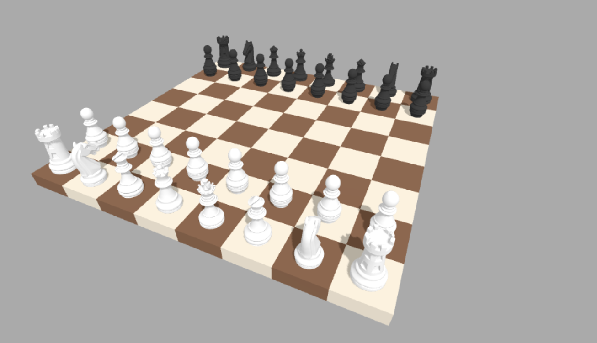

# WebGL 3D Chess

A 3D chess game built with Three.js that runs directly in your browser. This project showcases the use of WebGL for creating interactive 3D experiences.

## Live Demo

You can play the game live here: **[https://3d-chess-nine.vercel.app/](https://3d-chess-nine.vercel.app/)**

## Description

This project is a fully functional 3D chess game. It features a 3D board, complete set of pieces, and includes most of the standard chess rules. The game logic is separated from the rendering, making the code modular and easier to maintain. The game state, including valid moves, check, and checkmate, is handled by the logic scripts, while the visual representation is managed by Three.js.

## Features

The game includes the following chess rules and features:
* Standard piece movements
* Pawn promotion
* Castling (Kingside and Queenside)
* En Passant captures
* Check and Checkmate detection
* A user interface for pawn promotion choices
* A "Game Over" screen for checkmate and stalemate situations

### Not Yet Implemented
* **50-move rule**: The game does not currently track the 50-move rule for draws.
* **Stalemate (Patt)**: Although the logic can detect a stalemate situation (no legal moves but not in check), this is not fully implemented in the game flow.
* **Threefold repetition**: This rule for draws is also not implemented.

## Configuration & Customization

The project is structured to allow for easy visual customization.

### Piece Models & Textures
You can easily customize the appearance of the chess pieces. The 3D models for the pieces are loaded from the `assets/models/` directory. To use your own models, simply replace the `.glb` files in this directory with your own, making sure to keep the filenames the same: `pawn.glb`, `rook.glb`, `knight.glb`, `bishop.glb`, `queen.glb`, `king.glb`. The models can contain their own materials and textures, which will be loaded by the game.

### Piece & Board Colors
The primary colors for the board and pieces are defined as constants at the beginning of the `script.js` file. You can change these hexadecimal values to alter the look of the game:
* `WHITE_SQUARE_COLOR`: The color of the light squares.
* `BLACK_SQUARE_COLOR`: The color of the dark squares.
* `WHITE_PIECE_COLOR`: The material color for the white pieces.
* `BLACK_PIECE_COLOR`: The material color for the black pieces.
* `SELECTED_EMISSIVE_COLOR`: The highlight color for a selected piece.

### Piece Size & Position
* **Size**: The size of the pieces is dynamically scaled within the `pieceLoader.js` script. You can adjust the `desiredHeight` variable within the `loadModel` function to change the base height that all pieces are scaled to.
* **Positioning**: For fine-tuning, the `PIECE_ADJUSTMENTS` constant in `script.js` allows you to set a specific vertical offset (`yOffset`) and initial rotation (`initialRotationY`) for each piece type. This is useful if your custom models have different origins.

## Future Development

Here are some potential features and improvements for the future:
* **AI Opponent**: Implementing an AI of varying difficulty levels for single-player mode.
* **Online Multiplayer**: Adding networking capabilities for players to compete against each other over the internet.
* **Sound Effects**: Adding sounds for moves, captures, check, and other game events.
* **Custom Themes**: Creating a system to easily switch between different model and color themes (e.g., "Wood", "Metal", "Fantasy").
* **Move History & Annotation**: Displaying a list of moves made during the game (PGN format) and allowing for playback.
* **Full Rule Implementation**: Adding the missing draw rules (50-move rule, threefold repetition).

## A Note on Language

The comments within the source code are written in **Hungarian**. If you are interested in contributing or would like to better understand the code, I am happy to translate the comments to English upon request.

## License

This project is licensed under the MIT License. See the terms below.

Copyright (c) 2025 Csókosgéza

Permission is hereby granted, free of charge, to any person obtaining a copy of this software and associated documentation files (the "Software"), to deal in the Software without restriction, including without limitation the rights to use, copy, modify, merge, publish, distribute, sublicense, and/or sell copies of the Software, and to permit persons to whom the Software is furnished to do so, subject to the following conditions:

The above copyright notice and this permission notice shall be included in all copies or substantial portions of the Software.

THE SOFTWARE IS PROVIDED "AS IS", WITHOUT WARRANTY OF ANY KIND, EXPRESS OR IMPLIED, INCLUDING BUT NOT LIMITED TO THE WARRANTIES OF MERCHANTABILITY, FITNESS FOR A PARTICULAR PURPOSE AND NONINFRINGEMENT. IN NO EVENT SHALL THE AUTHORS OR COPYRIGHT HOLDERS BE LIABLE FOR ANY CLAIM, DAMAGES OR OTHER LIABILITY, WHETHER IN AN ACTION OF CONTRACT, TORT OR OTHERWISE, ARISING FROM, OUT OF OR IN CONNECTION WITH THE SOFTWARE OR THE USE OR OTHER DEALINGS IN THE SOFTWARE.

## Support the Project

If you like this repository and find it useful, please consider supporting my work. It helps me to dedicate more time to open-source projects like this.

You can support me via **[Buy Me a Coffee](https://buymeacoffee.com/csokosgeza)**. Thank you!
